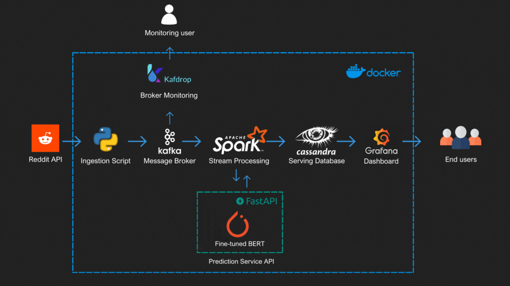

# Reddit Sentiment Analysis of the War in Palestine

## Overview

This project performs sentiment analysis on Reddit posts related to the war in Palestine. It leverages a modern data pipeline involving data ingestion, message brokering, stream processing, machine learning for sentiment prediction, and dashboard visualization. The entire setup is containerized using Docker and managed with Docker Compose.

## Architecture



### Components

1. **Reddit API**: Source of data, fetching posts related to the war in Palestine.
2. **Ingestion Script**: Python script to fetch data from Reddit API.
3. **Kafka**: Message broker to handle streaming data.
4. **Apache Spark**: For stream processing.
5. **Fine-tuned BERT Model**: Machine learning model to analyze sentiment.
6. **Cassandra**: Database to store processed data.
7. **Grafana**: Dashboard to visualize data.
8. **Kafdrop**: Kafka monitoring tool.
9. **Docker**: Containerization of services.
10. **FastAPI**: API service to expose the prediction model.

## Setup Instructions

### Prerequisites

- Docker
- Docker Compose

### How to Run

1. **Clone the Repository**:
   ```bash
   git clone https://github.com/yourusername/reddit-sentiment-analysis.git
   cd reddit-sentiment-analysis
   ```

2. **Build and Start Services**:
   ```bash
   docker-compose up --build
   ```

3. **Accessing Services**:
   - **Kafka Monitoring**: [http://localhost:9000](http://localhost:9000)
   - **Spark Master**: [http://localhost:8080](http://localhost:8080)
   - **Model Service**: [http://localhost:8081](http://localhost:8081)
   - **Grafana Dashboard**: [http://localhost:3000](http://localhost:3000)

## Components Details

### Reddit Producer

- **Purpose**: Fetches data from Reddit and sends it to Kafka.
- **Technology**: Python, Kafka
- **Key Files**:
  - `reddit-producer.py`: Main script to fetch and send data.
  - `config.yaml`: Configuration file for Reddit API and Kafka.

### Spark Stream Processing

- **Purpose**: Processes streaming data from Kafka.
- **Technology**: Apache Spark
- **Key Files**:
  - `spark-streaming.py`: Spark job to process and analyze data.

### Model Service

- **Purpose**: Provides an API to predict sentiment using a fine-tuned BERT model.
- **Technology**: FastAPI, PyTorch
- **Key Files**:
  - `app.py`: FastAPI application.
  - Model files in `model/` directory.

### Grafana

- **Purpose**: Visualizes the processed data.
- **Technology**: Grafana
- **Key Files**:
  - `grafana.ini`: Configuration file for Grafana.
  - `cassandra.yaml`: Datasource configuration for Cassandra.

## Monitoring

- **Kafdrop**: Monitor Kafka topics and brokers at [http://localhost:9000](http://localhost:9000)
- **Grafana**: Visualize data and monitor metrics at [http://localhost:3000](http://localhost:3000)

---

Feel free to contribute by opening issues or submitting pull requests. For major changes, please open an issue first to discuss what you would like to change.